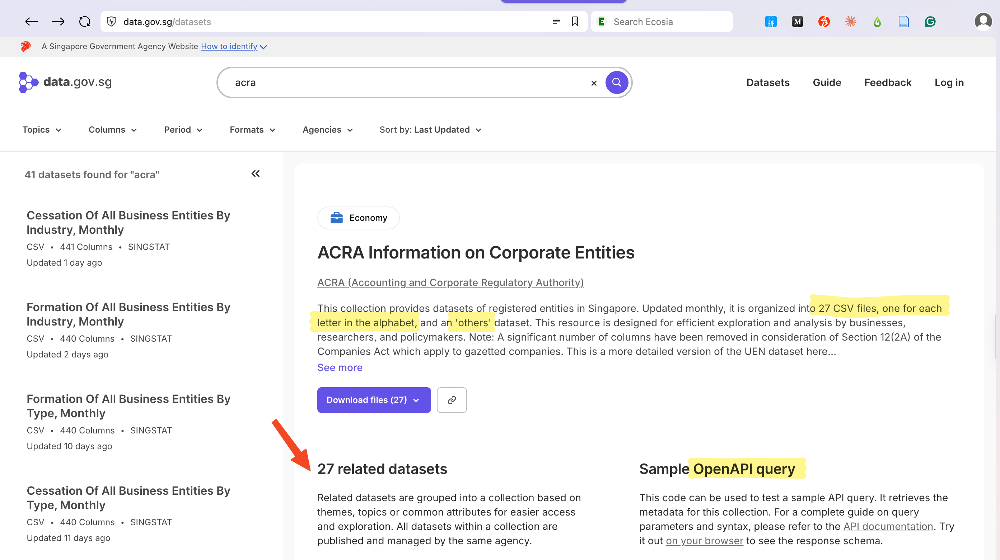
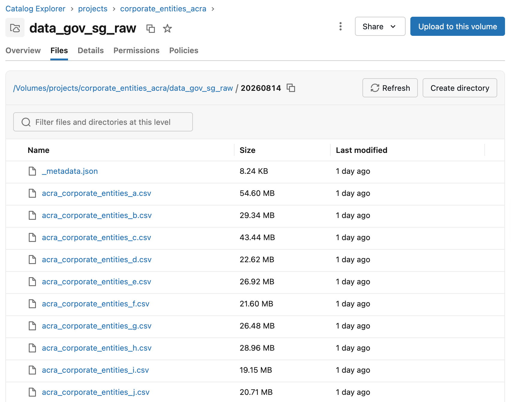
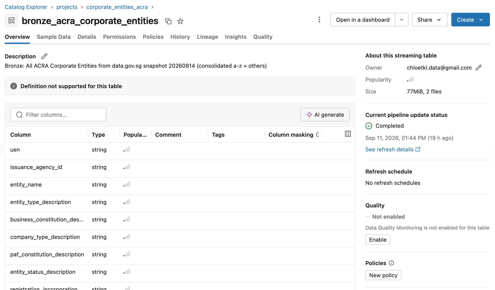
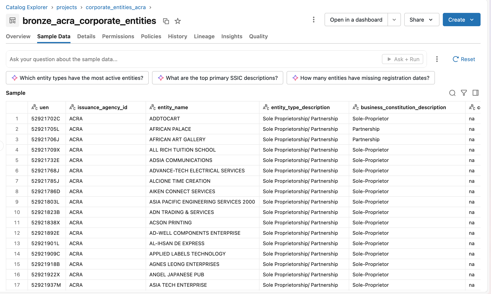

# ACRA Corporate Entities Data Pipeline

An end-to-end data pipeline that ingests 27 corporate entity datasets from [data.gov.sg](https://data.gov.sg/collections/2/view) into Databricks Unity Catalog, consolidates them into a bronze table, and provides dashboards for data discovery — with silver-layer transformations planned next.

## Stack & Tools

| Layer | Tool / Technology | Purpose |
| --- | --- | --- |
| Source | data.gov.sg API | Collection of 27 corporate entity datasets (A–Z + Others) |
| Secret Management | Databricks Unity Catalog Secrets | Stores the data.gov.sg API key |
| Ingestion (API → Stage) | Python notebook + `requests` | Downloads CSVs via poll-based download API |
| Storage (Stage) | Unity Catalog Volume | Stores CSV snapshots by date (YYYYMMDD) |
| Bronze (Stage → Bronze) | Lakeflow Spark Declarative Pipelines + Auto Loader | Consolidates 27 CSVs into one streaming table |
| Data Discovery | Databricks AI/BI Dashboards | Quick analytics on the full dataset |
| Silver (Bronze → Silver) | *(planned)* | Multiple views — demographics, active/inactive segments, etc. |

## Pipeline

### Stage 1 — Ingestion: API → Stage

**File:** `ingestion/data_gov_sg_to_uc_volume.ipynb`

**Input:** [data.gov.sg - ACRA Information on Corporate Entities Dataset](https://data.gov.sg/collections/2/view)



**Output:** 27 CSV files stored in Databricks UC Volume (`/Volumes/projects/corporate_entities_acra/data_gov_sg_raw/{YYYYMMDD}/`)



**Steps:**
- Retrieve dataset IDs for all 27 child datasets in the collection: `GET /collections/{id}/metadata`
- For each dataset, pull metadata and download link: `GET /datasets/metadata`, `GET /datasets/initiate-download`, `GET /datasets/poll-download`
- Write CSV files into a date-stamped snapshot folder in the UC Volume
- Save a `_metadata.json` summary file alongside the CSVs for pipeline reference

### Stage 2 — Bronze: Stage → Bronze

**File:** `transformation/uc_volume_to_bronze.py`

**Input:** CSV files in UC Volume snapshot folder

**Output:** Single consolidated bronze table `bronze_acra_corporate_entities` (2,110,094 rows)





**Steps:**
- Auto Loader reads all CSV files from the UC Volume snapshot path
- Schema inference with `addNewColumns` evolution mode and a rescued data column for mismatches
- Metadata columns added: `_ingested_at`, `_source_file`, `_snapshot_date`, `_dataset_letter`
- All 27 datasets concatenated into one unified bronze table

### Stage 3 — Data Discovery

**Tool:** Databricks Dashboards

Quick analytics built on top of the full bronze dataset to explore entity distributions, statuses, registration trends, and more.


### Stage 4 — Silver: Bronze → Silver *(planned)*

Multiple curated views of the data, including:
- Companies with demographics
- Segmented views of active vs non-active companies

This stage will be developed after data discovery is complete.

## Repository Structure

```
ACRA Corporate Entities Data Pipeline/
├── ingestion/
│   └── data_gov_sg_to_uc_volume.ipynb    # API → UC Volume (Stage 1)
├── transformation/
│   └── uc_volume_to_bronze.py            # UC Volume → Bronze table (Stage 2)
└── screenshots/                          # Screenshots for this README
```
